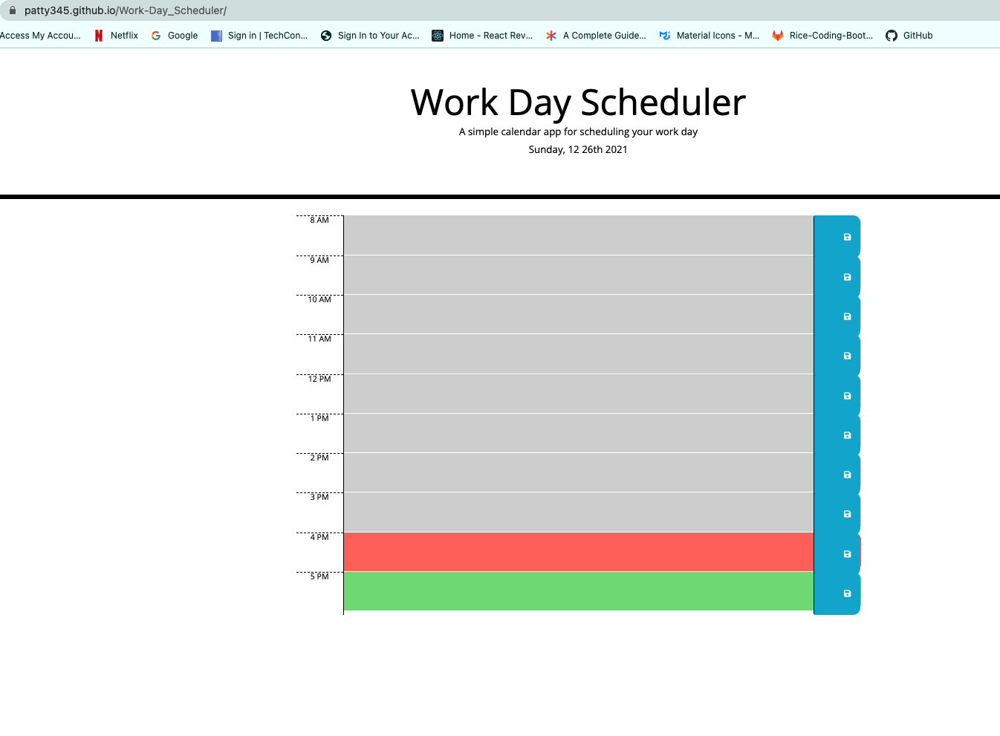

## Work Day Scheduler
This week challenge was to create a calendar application that allows user to save each hour of the day. 

- WHEN I open the planner
THEN the current day is displayed at the top of the calendar
- WHEN I scroll down
THEN I am presented with time blocks for standard business hours
- WHEN I view the time blocks for that day
THEN each time block is color-coded to indicate whether it is in the past, present, or future
- WHEN I click into a time block
THEN I can enter an event
- WHEN I click the save button for that time block
THEN the text for that event is saved in local storage
- WHEN I refresh the page
THEN the saved events persist

## Landing Page

## Usage 
Type any event for any of the time blocks for the current day. 
When the save button is clicked this will save to browser local storage. 

## Installation
Project was uploaded to [Github](https://github.com/) at the following repository: https://github.com/patty345/Work-Day_Scheduler 

You can find the deployed application in the Github pages link: https://patty345.github.io/Work-Day_Scheduler/

## Output 
The output of this challege was to work with Third-party api's. 